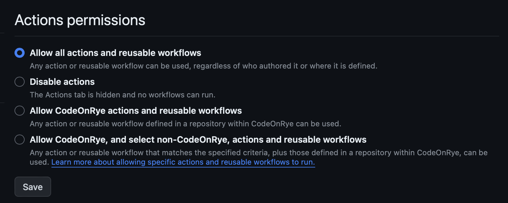
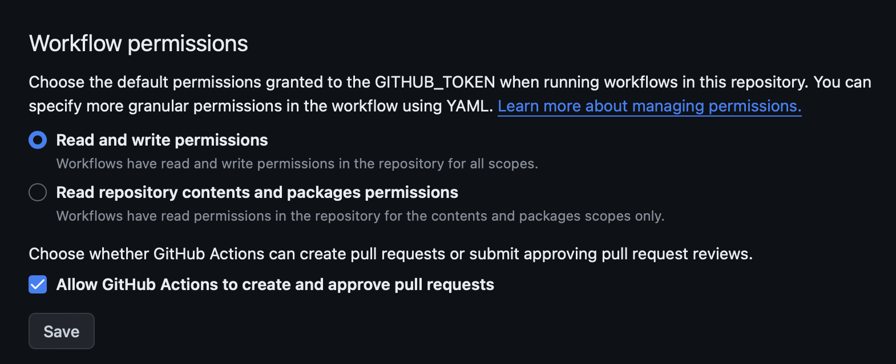
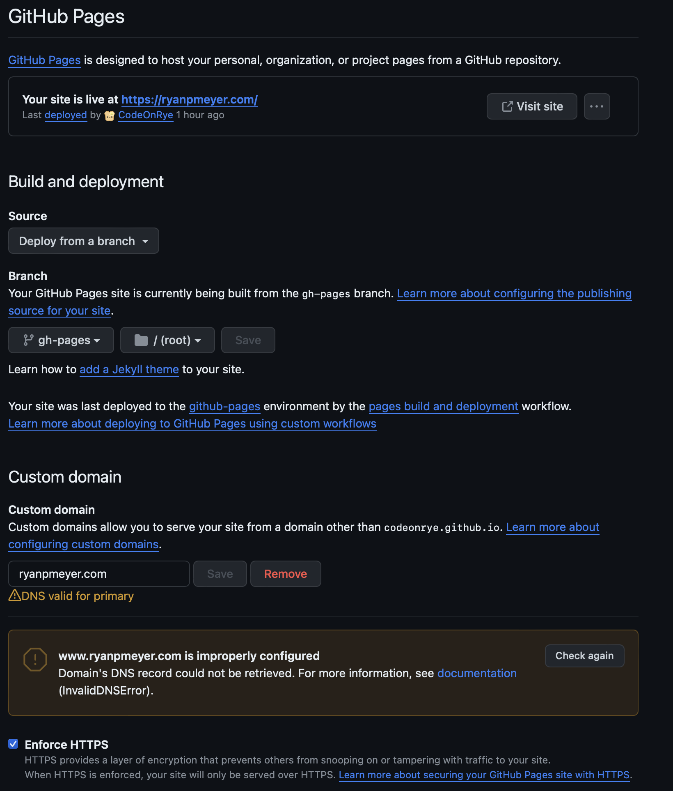


A scalable site.  


## Introduction


**Info:** This is not a full step by step guide, but one that can be used in combination with the standard guides available! Also I plan to update this after some time, so it will get better. 🙈


For those curious this guide is how I got this site up and running using a combination of Github, as the deployment automation and hosting of the site, and Hugo, a static website generator tool, using the Congo theme. This is all better documented on all the referenced sites, but this might help with bridging any gaps, or maybe provide a more concentrated interpretation of the above guides.

The assumptions are that you know your way around the terminal and know how to use tools like `git`, `brew` (for macs) and modify your domain's DNS. 

All references can be found at the following sites:

https://gohugo.io/getting-started/quick-start/ - Hugo quickstart guide. I would start here if you have no idea what is going on.
https://jpanther.github.io/congo/docs/installation/ - An end to end guide from the theme's creator. Really this should cover most everything.
https://docs.github.com/en/pages/getting-started-with-github-pages/about-github-pages - Important information using GitHub Pages (which is what we will be doing)
https://docs.github.com/en/pages/configuring-a-custom-domain-for-your-github-pages-site/managing-a-custom-domain-for-your-github-pages-site - Important information on DNS for your domain to point it to GitHub Pages.
https://github.com/CodeOnRye/codeonrye.github.io - Lastly, here is all the code running this site, so you could always start from there!

### Schema 

First let's lay out all the pieces to best understand how this will work.


graph TD
A[Repository Markdown Files] -->|Git Commit| B(GitHub)
B --> C{GitHub Actions}
C -->|Watches Main Branch| B
C --> F(Runs Hugo)
F -->|Processes MD to HTML| G(Pushed to gh_pages Branch)
D[Domain Registrar] -->|A Record| E(github.io)
G --> B
E --> G
subgraph Local
A
end
subgraph GitHub
B
C
F
G
end
subgraph DNS
D
E
end


As shown, wherever you may be sourcing your markdown files, once they are pushed to GitHub then the magic starts happening. A GitHub Action will run on commits, running a hugo service to generate the html files and pushing them back to a specific branch, `gh_pages`. This branch is configured in the repository to be the source for the github site. On the other end, the DNS registrar has an `A Record` set so that it redirects to the GitHub Provided site. Once it is all set up, then all you need to do is update your Hugo files and push!

## GitHub

You should start by setting up your GitHub repository and various settings as needed. This will help prepare for the automations and configurations later.

### Create Your Repo

One thing that got me, was that since we want to point to use the GitHub Pages functionality, we have to name the repository `YOURUSERNAME.github.io`. There may be another way to do this, but this is what I did.

Once created, go ahead and clone it down to your local environment.

```bash
git clone git@github.com:YOURUSERNAME/YOURUSERNAME.github.io.git
```


## Hugo

First things first. You need to get Hugo up and running and become familiar enough with it. Use the linked guide [above](https://gohugo.io/getting-started/quick-start/) to just try setting up a quick one locally. Once you get a feel comfortable with how it works with markdown files, then we can initialize it in the repository file we created in previous step.

```bash 
cd /PATH/TO/YOURUSERNAME.github.io 
hugo new site ./

```

### Congo Theme

Next we will install and set up the theme. As all themes are different, this may not apply to others, so take that with a grain of salt if you are deviating here.

We need to first pull down the theme, to do this we will use the `git submodule` function. This keeps our tooling from becoming more complex.

```bash
cd /PATH/TO/YOURUSERNAME.github.io
git init
git submodule add -b stable https://github.com/jpanther/congo.git themes/congo
```

Next we will need to configure Hugo to use this Theme. The [theme's guide](https://jpanther.github.io/congo/docs/installation/) is best to follow, as it will be more up-to-date. But to boil it down you need to copy the `/PATH/TO/YOURUSERNAME.github.io/theme/congo/config/_default` folder to `/PATH/TO/YOURUSERNAME.github.io/`. Now we customize the files as needed.

* **config.toml** - Your main config file for Hugo where you set your website name, theme (congo) and other settings
* **languages.en.toml** - Sets your defaults for the site when set in the `en` language.
* **markup.toml** - Used for the theme, I have not touched this.
* **menus.en.toml** - Like languages.en.toml, this is the configuration for the menus when set to the `en` language. 
* **module.toml** - Used for the theme, I have not touched this.
* **params.toml** - Allows you to further configure the theme. 

#### Making a Post

With this theme, I've decided to set up my posts within their own folders, rather than all under the `./content/` folder. This seems to work best for this theme. So a post will look roughly like this

```bash
content/posts/building-my-site
├── img
│   ├── gh_actions_permissions.png
│   ├── gh_pages_config.png
│   └── gh_workflow_permissions.png
└── index.md
```
Notice that the markdown file is named `index.md` and not the name of the post, that is reserved for the folder name. More examples can be found [here](https://jpanther.github.io/congo/docs/content-examples/)

## GitHub Actions

Lastly, once you have a nice site configured, and you've tested it out locally with the `hugo server -D` we can start working on getting the automations going to publish this online.

#### GitHub Actions Workflow File

You can leverage the default one provided by the theme [here](https://jpanther.github.io/congo/docs/hosting-deployment/#github-pages). This should work out of the box for you. Once you add it to your `/PATH/TO/YOURUSERNAME.github.io/.github/workflows/` folder and push it to GitHub you will need to verify it runs successfully.

One thing to note here, if you are going to use a custom domain you will want to add a run command into your YAML file to recreate that file like below:
```YAML
...
      - name: Build
        run: hugo --minify

      - name: GH CNAME
        run: echo "YOURDOMAIN.COM" > ./public/CNAME

      - name: Deploy
...
```

On GitHub you can navigate to your repository, and then the Actions Page to verify if it is running properly. If not you will want to check the follow settings.

#### GitHub Repository Settings

Make sure your settings are as follows:





Those should fix it to allow the actions to properly run. Once they do you will now have a `gh_pages` branch that mirror's the contents of the `public` folder that Hugo generates when running the hugo commands.

## DNS

Last but not least, we will now make the site available online! First we finish configuring GitHub, test and then point our domain to it.

### GitHub Pages

Under the repository's settings for Pages you will want to configure it as follows



A few things to note, you can only enable SSL enforcement once your custom domain is configured (next step). But this will be fine for now to test. You should now be able to got to YOURUSERNAME.github.io and see your site! If you do then finish configurations on your domain registrar.

### Domain DNS

First you should go to your account settings, then under the Pages option on the left sidebar, add your domain there. You will need to verify the domain with a `TXT Record `. 

Per the [details](https://docs.github.com/en/pages/configuring-a-custom-domain-for-your-github-pages-site/managing-a-custom-domain-for-your-github-pages-site) from GitHub you will want to add the follow records to your Domain's DNS provider.

`A Record`
```
185.199.108.153
185.199.109.153
185.199.110.153
185.199.111.153
```

`AAAA Record`
```
2606:50c0:8000::153
2606:50c0:8001::153
2606:50c0:8002::153
2606:50c0:8003::153
```

`CNAME Record`
```
www.YOURDOMAIN.com
```

I would avoid using the Alias, as that would block you from using DNSSEC.

At this point you should now be able to go to yourdomain.com and load your github site. If needed, go back to your settings and enable SSL.

# Conclusion

This rough guide is how I have mine set up with tips on how you can do it yourself. Again, it isn't meant to be an end-to-end guide. But over time I will probably update this guide to better clarify or expand items.